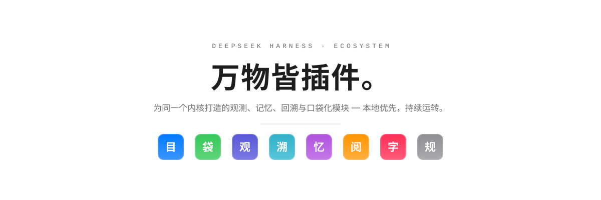
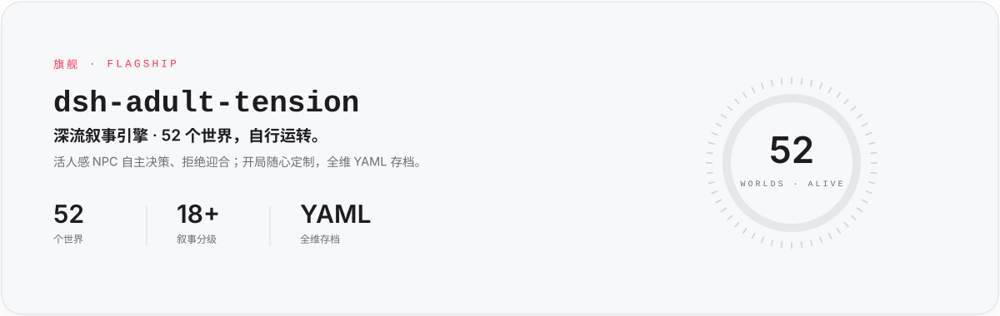
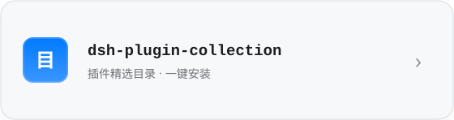
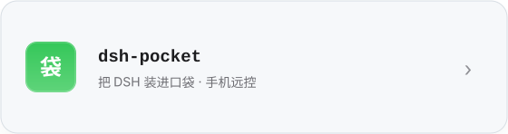
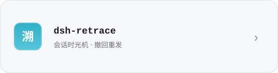
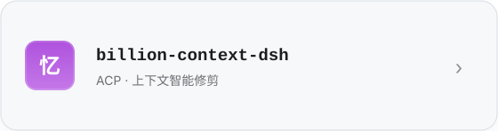
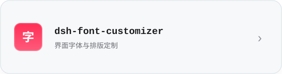
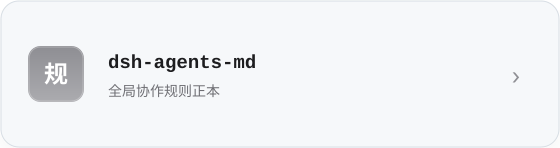

<picture>
  <source media="(prefers-color-scheme: dark)" srcset="./assets/apple/hero-dark.svg">
  
</picture>

我在为 [DeepSeek Harness](https://github.com/daha1216/deepseek-harness)（DSH）建造一整个生态——一个「万物皆插件」的本地 AI Agent 运行时。观测它、记住它、回溯它、把它装进口袋。

## 旗舰

<a href="https://github.com/daha1216/dsh-adult-tension">
  <picture>
    <source media="(prefers-color-scheme: dark)" srcset="./assets/apple/flagship-dark.svg">
    
  </picture>
</a>

  
  &nbsp;
  

## 模块

> 每个模块只做一件事。

| | |
|---|---|
| <a href="https://github.com/daha1216/dsh-plugin-collection"><picture><source media="(prefers-color-scheme: dark)" srcset="./assets/apple/u1-dark.svg"></picture></a> | <a href="https://github.com/daha1216/dsh-pocket"><picture><source media="(prefers-color-scheme: dark)" srcset="./assets/apple/u2-dark.svg"></picture></a> |
| <a href="https://github.com/daha1216/dsh-watcher"><picture><source media="(prefers-color-scheme: dark)" srcset="./assets/apple/u3-dark.svg"></picture></a> | <a href="https://github.com/daha1216/dsh-retrace"><picture><source media="(prefers-color-scheme: dark)" srcset="./assets/apple/u4-dark.svg"></picture></a> |
| <a href="https://github.com/daha1216/billion-context-dsh"><picture><source media="(prefers-color-scheme: dark)" srcset="./assets/apple/u5-dark.svg"></picture></a> | <a href="https://github.com/daha1216/dsh-better-display"><picture><source media="(prefers-color-scheme: dark)" srcset="./assets/apple/u6-dark.svg"></picture></a> |
| <a href="https://github.com/daha1216/dsh-font-customizer"><picture><source media="(prefers-color-scheme: dark)" srcset="./assets/apple/u7-dark.svg"></picture></a> | <a href="https://github.com/daha1216/dsh-agents-md"><picture><source media="(prefers-color-scheme: dark)" srcset="./assets/apple/u8-dark.svg"></picture></a> |

<b>工程日志 · ENGINEERING LOG</b>

 

- **设计体系** — Apple 产品页语法：石墨墨色 `#1D1D1F` / `#F5F5F7`，系统色小图标（蓝 `#007AFF` · 绿 `#34C759` · 靛 `#5856D6` · 青 `#30B0C7` · 紫 `#AF52DE` · 橙 `#FF9500` · 粉 `#FF2D55`），旗舰专属玫瑰红 `#FF375F`。全部资产提供浅色 / 深色双模式，经 `<picture>` + `prefers-color-scheme` 自适应。规格详见 [DESIGN.md](./DESIGN.md)。
- **备份** — 上一代「Apple 白卡 v1」封存于 [`backup/pre-redesign-20260930`](https://github.com/daha1216/daha1216/tree/backup/pre-redesign-20260930)；同日 PCB 背板体系草案封存于 [`backup/pcb-draft-20260930`](https://github.com/daha1216/daha1216/tree/backup/pcb-draft-20260930)。
- **维护哲学** — 每个模块只做一件事 · 观测优先于控制 · 本地优先，云可选。

---

REV 3.0 · 2026 · DESIGNED WITH RESTRAINT BY <a href="https://github.com/daha1216">DAHA</a>
