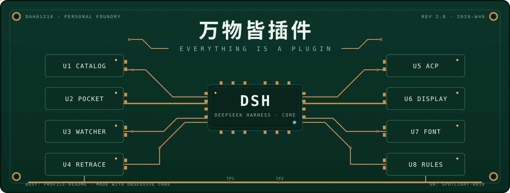
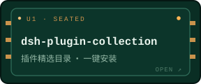
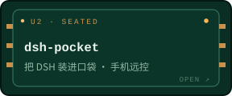
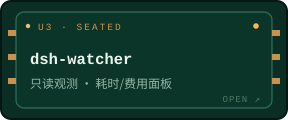
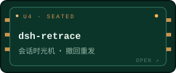
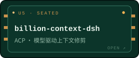
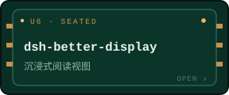
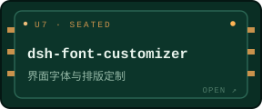
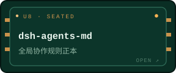

欢迎来到我的背板。我围绕 [DeepSeek Harness](https://github.com/daha1216/deepseek-harness)（DSH）——一个「万物皆插件」的本地 AI Agent 运行时——建造完整生态：观测它、记住它、回溯它、把它装进口袋。下面的每一个仓库，都是插在这块板上运转的模块。

## 模块档案 · MODULE DATASHEET

| | |
|---|---|
| **定位** | 本地优先 AI Agent 生态 · 独立建造者 |
| **内核** | [DeepSeek Harness](https://github.com/daha1216/deepseek-harness) — Everything is a Plugin |
| **旗舰** | `dsh-adult-tension` · 52 世界叙事引擎 · 18+ |
| **语言** | 中文 · TypeScript / Python / PowerShell |
| **节拍** | 持续插拔中 · 每周有模块更新 |

  
  &nbsp;
  

## 已插拔模块 · SEATED MODULES

| | |
|---|---|
|  |  |
|  |  |
|  |  |
|  |  |

> **「万物皆插件——包括这个主页。」**
>
> THIS PROFILE IS ITSELF A MODULE, SEATED ON ITS OWN BACKPLANE.

<b>工程日志 · ENGINEERING LOG</b>

 

- **位号语义** — `U0` 为旗舰专用位，`U1`–`U8` 为标准座位，与顶部背板图中的座位一一对应；新增仓库 = 新增座位。
- **设计体系** — 深绿阻焊 `#0C352A` · 铜走线 `#C9924C` · 丝印白 `#EAF5EE` · 信号薄荷 `#63E6BE` · 张力红 `#E5534B`。所有资产自带基板，深浅色模式下观感一致。规格详见 [DESIGN.md](./DESIGN.md)。
- **上一代设计** — Apple 白卡体系（spotlight 卡迭代至 v16）已完整封存于 [`backup/pre-redesign-20260930`](https://github.com/daha1216/daha1216/tree/backup/pre-redesign-20260930) 分支，随时可回溯。
- **维护哲学** — 每个模块只做一件事 · 观测优先于控制 · 本地优先，云可选。

---

REV 2.0 · 2026-W40 · DESIGNED &amp; MAINTAINED BY <a href="https://github.com/daha1216">DAHA1216</a> ON A GREEN BOARD
