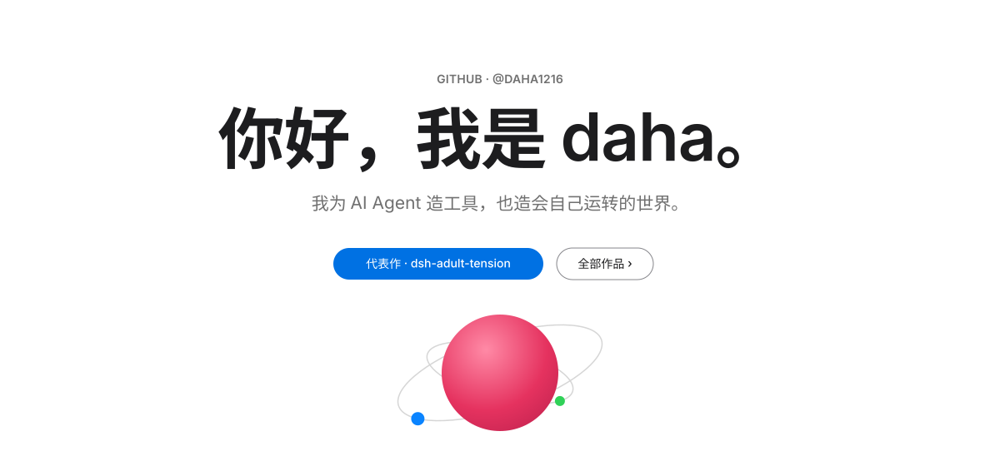
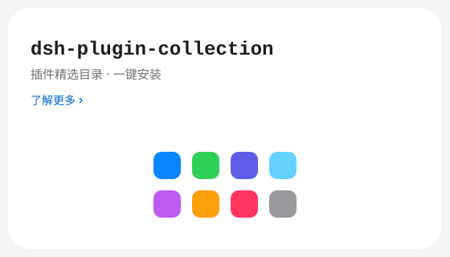
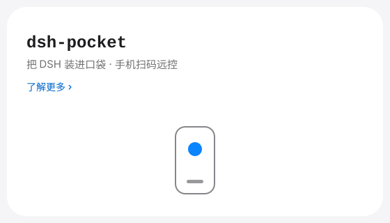
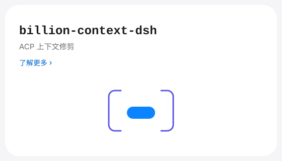
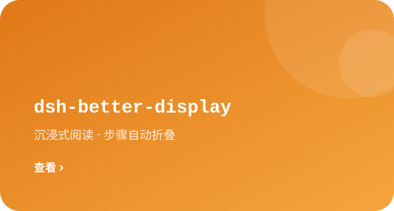
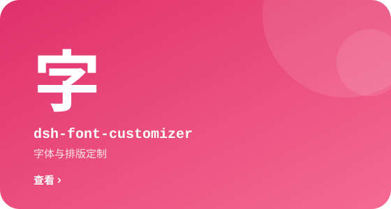

<picture>
  <source media="(prefers-color-scheme: dark)" srcset="./assets/gallery/hero-dark.svg">
  
</picture>

我在为 [DeepSeek Harness](https://github.com/daha1216/deepseek-harness)（DSH）建造一整个生态——一个「万物皆插件」的本地 AI Agent 运行时。观测它、记住它、回溯它、把它装进口袋。

<a href="https://github.com/daha1216/dsh-adult-tension">
  <picture>
    <source media="(prefers-color-scheme: dark)" srcset="./assets/gallery/flagship-dark.svg">
    
  </picture>
</a>

  <a href="https://github.com/daha1216/dsh-adult-tension/stargazers">
    <picture>
      <source media="(prefers-color-scheme: dark)" srcset="https://img.shields.io/github/stars/daha1216/dsh-adult-tension?style=flat-square&label=%E2%98%85&labelColor=0D1117&color=0071E3">
      
    </picture>
  </a>
  &nbsp;
  <picture>
    <source media="(prefers-color-scheme: dark)" srcset="https://img.shields.io/badge/18%2B-%E5%89%A7%E6%83%85%E5%86%85%E5%AE%B9-B64400?style=flat-square&labelColor=0D1117">
    
  </picture>

<picture>
  <source media="(prefers-color-scheme: dark)" srcset="./assets/gallery/modules-head-dark.svg">
  
</picture>

| | |
|---|---|
| <a href="https://github.com/daha1216/dsh-plugin-collection"><picture><source media="(prefers-color-scheme: dark)" srcset="./assets/gallery/u1-dark.svg"></picture></a> | <a href="https://github.com/daha1216/dsh-pocket"><picture><source media="(prefers-color-scheme: dark)" srcset="./assets/gallery/u2-dark.svg"></picture></a> |
| <a href="https://github.com/daha1216/dsh-watcher"><picture><source media="(prefers-color-scheme: dark)" srcset="./assets/gallery/u3-dark.svg"></picture></a> | <a href="https://github.com/daha1216/dsh-retrace"><picture><source media="(prefers-color-scheme: dark)" srcset="./assets/gallery/u4-dark.svg"></picture></a> |
| <a href="https://github.com/daha1216/billion-context-dsh"><picture><source media="(prefers-color-scheme: dark)" srcset="./assets/gallery/u5-dark.svg"></picture></a> | <a href="https://github.com/daha1216/dsh-better-display"><picture><source media="(prefers-color-scheme: dark)" srcset="./assets/gallery/u6-dark.svg"></picture></a> |
| <a href="https://github.com/daha1216/dsh-font-customizer"><picture><source media="(prefers-color-scheme: dark)" srcset="./assets/gallery/u7-dark.svg"></picture></a> | <a href="https://github.com/daha1216/dsh-agents-md"><picture><source media="(prefers-color-scheme: dark)" srcset="./assets/gallery/u8-dark.svg"></picture></a> |

<b>工程日志 · ENGINEERING LOG</b>

 

- **设计体系** — Apple 白色画廊（REV 4.0）：纯白画布 × `#F5F5F7` 交替色带产生节奏，28px 圆角、零阴影、零边框。界面保持单色（墨 `#1D1D1F` · 次级 `#6E6E73` · 钢灰 `#86868B`），只保留一条蓝色线索——`#0071E3` 胶囊 CTA 与 `#0066CC` 行内链接；赭 `#B64400` 裸文字状态标；彩色只存在于模块「饰面样块」（iOS 系统色浅/深两套）。全部资产双模式，经 `<picture>` + `prefers-color-scheme` 自适应，徽章亦双源同化进画布。规格详见 [DESIGN.md](./DESIGN.md)。
- **备份** — REV 3.0（Apple 白卡 + 投影体系）封存于 [`backup/rev3-20260930`](https://github.com/daha1216/daha1216/tree/backup/rev3-20260930)；初代白卡 v1 于 [`backup/pre-redesign-20260930`](https://github.com/daha1216/daha1216/tree/backup/pre-redesign-20260930)；PCB 背板草案于 [`backup/pcb-draft-20260930`](https://github.com/daha1216/daha1216/tree/backup/pcb-draft-20260930)。
- **维护哲学** — 每个模块只做一件事 · 观测优先于控制 · 本地优先，云可选。

<picture>
  <source media="(prefers-color-scheme: dark)" srcset="./assets/gallery/footer-dark.svg">
  
</picture>

<a href="./DESIGN.md">设计规格 · DESIGN.md ›</a>

