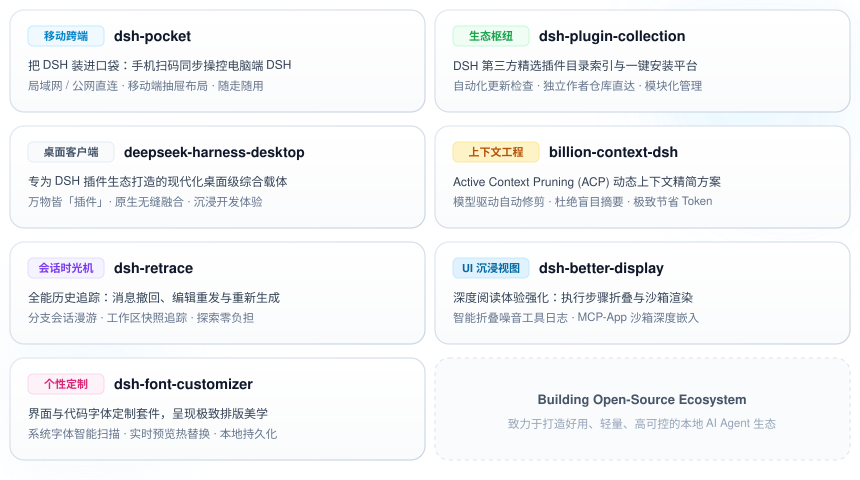

<h1 align="center" style="border-bottom: none; font-size: 32px; font-weight: 700; margin-bottom: 8px;">Hi there, I'm daha 👋</h1>

 

  

  

<h2 align="center" style="border-bottom: none; font-size: 20px; font-weight: 700; margin-bottom: 6px; color: #0f172a;">
  🧩 DeepSeek Harness 生态矩阵
</h2>

  致力于打造更好用、更轻量、更强大的本地 AI Agent 生态与交互体系

<!-- 实时 Stars 苹果浅色药丸导航按钮阵列 (Shields.io 动态同步) -->

  
  &nbsp;
  
  &nbsp;
  
  &nbsp;
  

  
  &nbsp;
  
  &nbsp;
  

