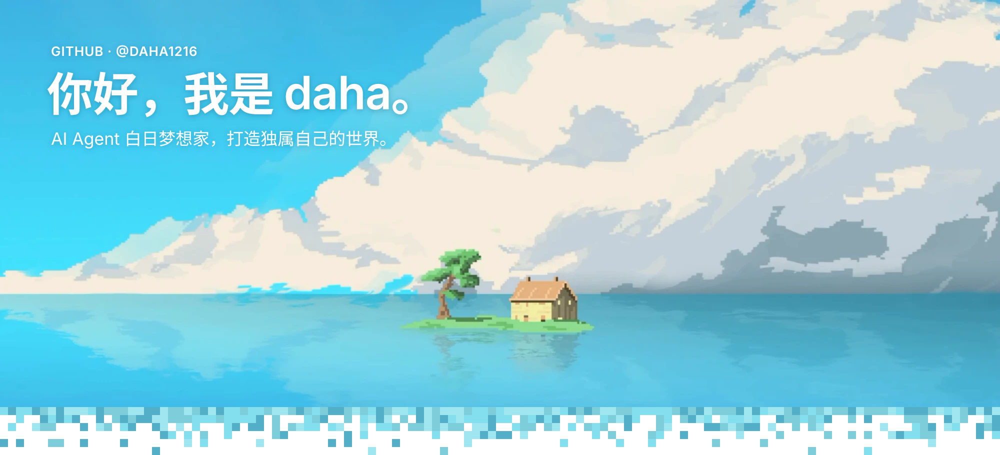
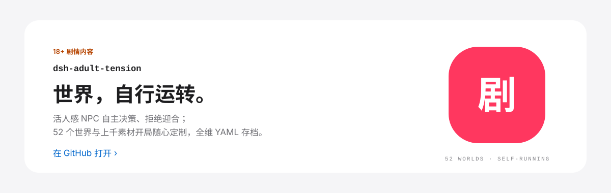
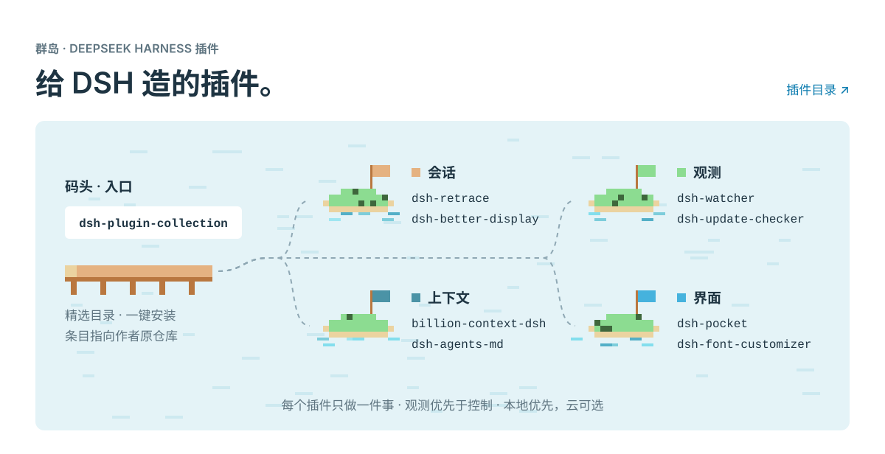
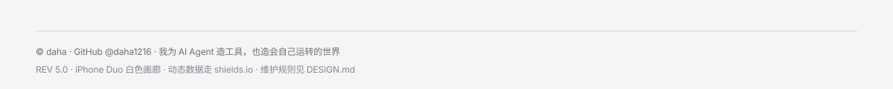

<a href="https://github.com/daha1216/dsh-adult-tension">
  <picture>
    <source media="(prefers-color-scheme: dark)" srcset="./assets/gallery/flagship-dark.svg">
    
  </picture>
</a>

  <a href="https://github.com/daha1216/dsh-adult-tension/stargazers">
    <picture>
      <source media="(prefers-color-scheme: dark)" srcset="https://img.shields.io/github/stars/daha1216/dsh-adult-tension?style=flat-square&label=%E2%98%85&labelColor=0D1117&color=137FB0">
      
    </picture>
  </a>
  &nbsp;
  <picture>
    <source media="(prefers-color-scheme: dark)" srcset="https://img.shields.io/badge/18%2B-%E5%89%A7%E6%83%85%E5%86%85%E5%AE%B9-A85A1E?style=flat-square&labelColor=0D1117">
    
  </picture>

<a href="https://github.com/daha1216/dsh-plugin-collection">
  <picture>
    <source media="(prefers-color-scheme: dark)" srcset="./assets/gallery/ecosystem-dark.svg">
    
  </picture>
</a>

| | 插件 | 做什么 |
|---|---|---|
| 代表作 | [dsh-adult-tension](https://github.com/daha1216/dsh-adult-tension) | 18+ 成人互动叙事：活人感 NPC、数十个世界上千素材、开局随心定制、世界自行运转。 |
| 入口 | [dsh-plugin-collection](https://github.com/daha1216/dsh-plugin-collection) | 第三方插件精选目录，一键安装，条目指向作者原仓库 |
| 会话 | [dsh-retrace](https://github.com/daha1216/dsh-retrace) | 会话时光机：撤回 / 编辑重发 / 重新生成，产物版本化 fork |
| 会话 | [dsh-better-display](https://github.com/daha1216/dsh-better-display) | 沉浸式阅读：执行步骤自动折叠，MCP-App 交互沙箱 fork |
| 观测 | [dsh-watcher](https://github.com/daha1216/dsh-watcher) | 只读观测：模型耗时 / 费用统计，浮动面板 |
| 观测 | [dsh-update-checker](https://github.com/daha1216/dsh-update-checker) | 检查已装插件的上游更新与 changelog，只查不装 |
| 上下文 | [billion-context-dsh](https://github.com/daha1216/billion-context-dsh) | 模型自主决定何时压缩上下文（ACP）移植自 billion-context-pi |
| 上下文 | [dsh-agents-md](https://github.com/daha1216/dsh-agents-md) | 用户级全局 AGENTS.md：协作与反谄媚规则 |
| 界面 | [dsh-pocket](https://github.com/daha1216/dsh-pocket) | 手机扫码，同步操控电脑端 DSH |
| 界面 | [dsh-font-customizer](https://github.com/daha1216/dsh-font-customizer) | 界面 / 代码字体与字号定制 |

**DSH 之外** — [ClaudeGuard](https://github.com/daha1216/ClaudeGuard)（Rust · Tauri 2）：Windows 上给 AI 桌面应用加一道网络出口门禁，只在约定代理出口放行，出口异常即刻熔断断网。

<picture>
  <source media="(prefers-color-scheme: dark)" srcset="./assets/gallery/footer-dark.svg">
  
</picture>
